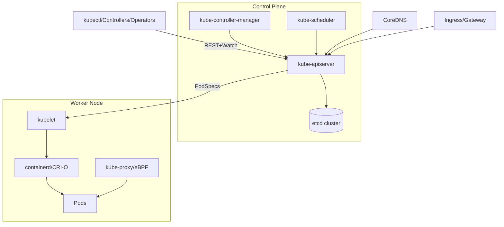

## Kubernetes 架构总览

本文档面向平台工程师与集群运维人员，系统性阐述 Kubernetes 的核心架构、关键组件、职责边界与高可用设计，帮助读者建立整体心智模型并指导落地实践。

### 目标与核心理念

- **声明式期望状态**: 通过 API Server 提交对象期望状态，控制器异步调和至实际状态。
- **可组合控制回路**: 各控制器职责单一、松耦合，通过共享状态（etcd）协同工作。
- **可插拔扩展**: CNI/CSI/CRI、准入控制器、聚合 API、控制器/Operator。

### 控制平面（Control Plane）

- **kube-apiserver**: 集群唯一入口，REST 接口与鉴权/鉴别/准入校验，写入 etcd。
- **etcd**: 强一致分布式 KV 存储，保存集群期望状态与元数据。
- **kube-controller-manager**: 内置一组控制器（Deployment、ReplicaSet、Node、Job、EndpointSlice 等），负责状态调和。
- **kube-scheduler**: 基于可调度约束与打分策略为 Pod 选择最优节点。
- （可选）**cloud-controller-manager**: 与 IaaS 云交互（LB、EIP、存储卷、节点生命周期等）。

### 节点组件（Node Components）

- **kubelet**: 节点代理，拉取 PodSpec 并通过 CRI 驱动容器运行时创建 Pod；上报心跳与状态。
- **容器运行时（CRI）**: 常见为 containerd、CRI-O。负责镜像管理与容器生命周期。
- **kube-proxy**: 实现 Service 虚拟 IP 到后端 Pod 的转发（iptables/IPVS）。
- （可选）**节点监控/日志代理**: node-exporter、cAdvisor、Fluent Bit 等。

### 对象模型与编排

- **工作负载**: Pod、ReplicaSet、Deployment、StatefulSet、DaemonSet、Job/CronJob。
- **配置与密钥**: ConfigMap、Secret。
- **服务暴露**: Service（ClusterIP/NodePort/LoadBalancer）、Ingress、Gateway API。
- **调度与约束**: 资源请求/上限、亲和/反亲和、污点/容忍、拓扑分布、优先级抢占。

### 网络

- **Pod 网络（CNI）**: 每个 Pod 拥有独立 IP；常见 CNI：Calico、Cilium、Flannel。
- **Service 转发**: kube-proxy（iptables/IPVS）或 eBPF（如 Cilium）实现服务转发与负载均衡。
- **DNS**: CoreDNS 提供服务发现（svc.cluster.local）。
- **网络策略**: NetworkPolicy 基于标签进行东西向访问控制。

### 存储

- **卷抽象**: PV/PVC 解耦存储提供与消费。
- **CSI 插件**: 通过 CSI 驱动对接块存储/文件存储；支持动态供给、快照与扩容。

### 服务入口与南北向流量

- **Ingress/Ingress Controller**: 如 NGINX、HAProxy、Traefik、Envoy；或使用 **Gateway API**。
- **外部负载均衡**: Service `type=LoadBalancer` 通过云厂商或 MetalLB 分配对外地址。

### 安全与多租户

- **认证/鉴权**: X.509、OIDC；RBAC 实现基于角色的细粒度授权。
- **ServiceAccount** 与 Token 投射；**准入控制器** 进行策略校验与变更（Mutating/Validating）。
- **网络隔离**: 基于 Namespace 与 NetworkPolicy；**Pod 安全标准（PSS）/PSA** 管控权限边界。

### 高可用与伸缩

- **控制平面高可用**: 多副本 apiserver + 负载均衡，etcd 奇数副本（3/5）；
  - Stacked etcd（每控平节点自带本地 etcd）；
  - External etcd（独立 etcd 集群，推荐生产）。
- **工作负载伸缩**: HPA/VPA/Cluster Autoscaler。
- **故障域与拓扑分布**: 多可用区/机架感知调度与反亲和。

### 事件流与控制回路

控制器周期性 List/Watch API Server 中的对象变化，计算期望与实际的差异并调用底层组件执行；失败重试与幂等确保最终一致性。

### 参考拓扑图（Mermaid）

### 术语速查

- **期望状态**: 用户声明希望系统达到的目标。
- **调和（Reconcile）**: 控制器将实际状态推进到期望状态的过程。
- **控制器/Operator**: 以控制回路实现特定领域自动化的程序。

### 参考与延伸

- Kubernetes 官方文档（Architecture、Concepts、Extend K8s）。
- CNCF 项目：CNI、CSI、Prometheus、Envoy、OpenTelemetry、Argo 家族。

