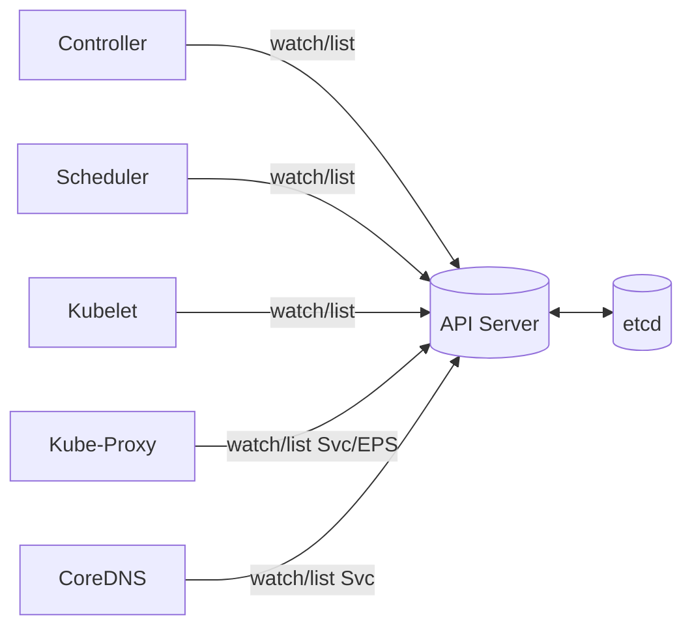

## 模块交互：控制面与节点（中文）

展示 API Server、Controller、Scheduler 与节点侧 Kubelet/Kube-Proxy 的交互与数据契约。

```mermaid
flowchart LR
  APIS[(API Server)] <--> ETCD[(etcd)]
  CM[Controller] -- watch/list --> APIS
  SCH[Scheduler] -- watch/list --> APIS
  KL[Kubelet] -- watch/list --> APIS
  KProxy[Kube-Proxy] -- watch/list Svc/EPS --> APIS
  CoreDNS -- watch/list Svc --> APIS
```

### 交互要点

- 访问模式：所有内部组件通过 APIS 交互，避免直连存储；
- 一致性：组件使用 watch + 缓存，依赖资源版本推进；
- 回写：仅在必要时回写（如绑定、状态上报），减少写放大。

