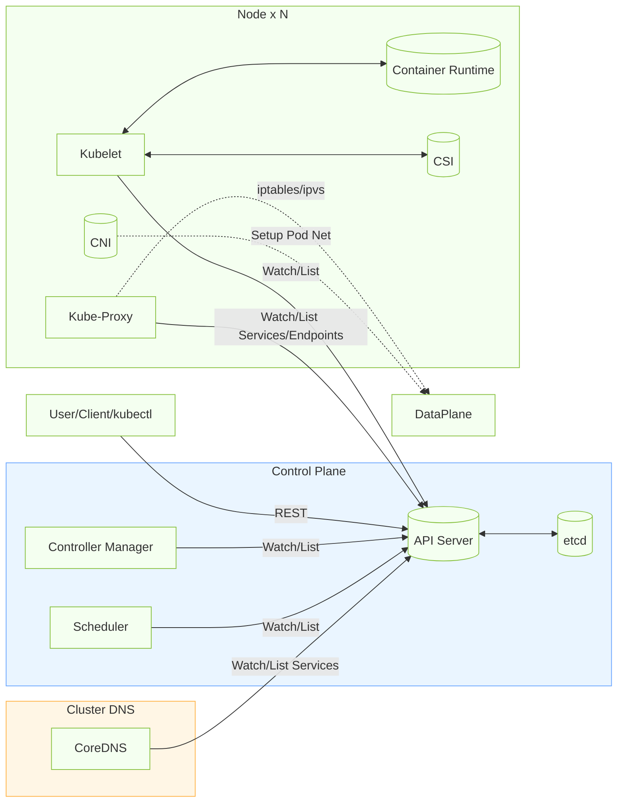
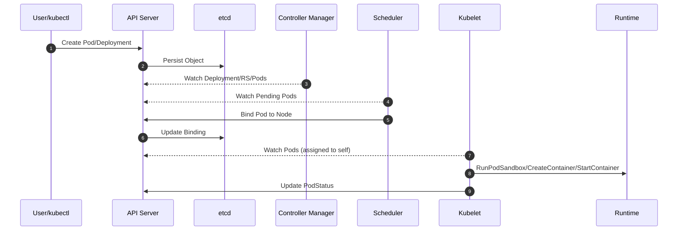

## Kubernetes 架构图（中文）

本文用图示呈现控制面、节点数据面、对象流转与扩展点，配合 `docs/overview/architecture.md` 一起阅读。

```mermaid
flowchart LR
  subgraph ControlPlane[Control Plane]
    APIS[(API Server)]
    CM[Controller Manager]
    SCH[Scheduler]
    ETCD[(etcd)]
  end

  subgraph Node[Node x N]
    Kubelet[Kubelet]
    KProxy[Kube-Proxy]
    CRI[(Container Runtime)]
    CNI[(CNI)]
    CSI[(CSI)]
  end

  subgraph DNS[Cluster DNS]
    CoreDNS[CoreDNS]
  end

  User[User/Client/kubectl] -->|REST| APIS
  CM -->|Watch/List| APIS
  SCH -->|Watch/List| APIS
  APIS <--> ETCD
  Kubelet -->|Watch/List| APIS
  Kubelet <--> CRI
  Kubelet <--> CSI
  KProxy -->|Watch/List Services/Endpoints| APIS
  CoreDNS -->|Watch/List Services| APIS

  KProxy -.->|iptables/ipvs| DataPlane
  CNI -.->|Setup Pod Net| DataPlane
  classDef cp fill:#eaf5ff,stroke:#6aa5ff;
  classDef node fill:#f4fff0,stroke:#87c13f;
  classDef dns fill:#fff6e5,stroke:#ffb347;
  class ControlPlane cp;
  class Node node;
  class DNS dns;
```

```mermaid
sequenceDiagram
  autonumber
  participant U as User/kubectl
  participant APIS as API Server
  participant ETCD as etcd
  participant CM as Controller Manager
  participant SCH as Scheduler
  participant KL as Kubelet
  participant CRI as Runtime

  U->>APIS: Create Pod/Deployment
  APIS->>ETCD: Persist Object
  CM-->>APIS: Watch Deployment/RS/Pods
  SCH-->>APIS: Watch Pending Pods
  SCH->>APIS: Bind Pod to Node
  APIS->>ETCD: Update Binding
  KL-->>APIS: Watch Pods (assigned to self)
  KL->>CRI: RunPodSandbox/CreateContainer/StartContainer
  KL->>APIS: Update PodStatus
```

